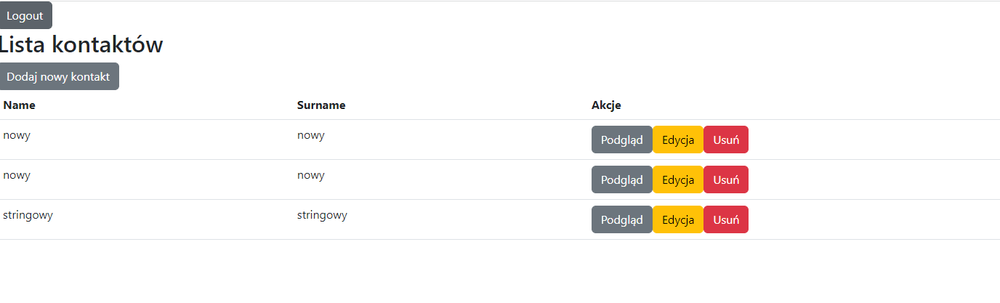

## Simple application where you can add new contacts and modify them

## Setup

* Open project in Microsoft Visual Studio 2022 
* In ContactApi project open appsettings.json
    * Fill in connection to your database in DefaultConnection (Microsoft SQL Server)
    * Fill in secret for JWT (some random characters like: asdanviuhxcasdasdasdasdasdasdasdv - it has to be at least 128 bit long)
* Angular requires nodejs so you should have it on your computer
* Open Package Manager Console
    * Set Default project to Database
    * Run update-database
* Set multiple startup projects: 
    * 1st - ContactApi 
    * 2nd - ContactUI
* Run the app
* Default user credential needed to log into the app 
    * Username: test 
    * Password: Test.123

## List of external libraries
* MediatR.Extensions.Microsoft.DependencyInjection
* MediatR
* Microsoft.AspNetCore.Authentication.JwtBearer
* Microsoft.AspNetCore.Identity.EntityFrameworkCore
* Microsoft.EntityFrameworkCore.SqlServer
* Microsoft.EntityFrameworkCore.Tools

## Project structure

* ContactApi - api, controllers
* Model - Representation of objects in database
* Database - ApplicationDbContext is configured here as well as migrations for database
* Utility - Classes used in Logic and ContactApi projects
* Logic - Validations, operations on database take place here

# Main flow of the application is to 
* Receive a model at given endpoint
* Create a command / query and send it via mediatr
* mediatr is configured to pass data to specific command / query handlers inside Logic project
* All meduatr requests return to the controllers and appropriate response is built and sent back to the user